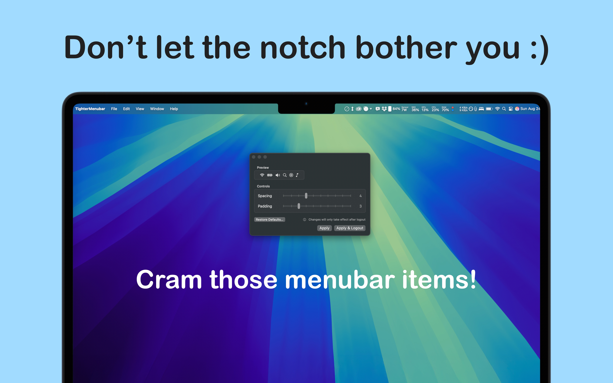

# TighterMenubar

A simple macOS utility for customizing menu bar item spacing and padding to create a more compact menu bar layout.

## What it does

TighterMenubar allows you to adjust two key aspects of your macOS menu bar:

- **Spacing**: Controls the gap between menu bar items
- **Padding**: Controls the clickable area around each menu bar item

Both settings can be adjusted from 1 (tightest) to 10 (default system spacing), giving you fine control over your menu bar's appearance and density.

## Features

- Real-time preview of menu bar layout changes
- Progressive scaling from ultra-tight (level 1) to system default (level 10)
- Automatic font size detection and scaling
- Host-specific settings (laptop and desktop can have different configurations)
- Graceful menu bar refresh without requiring system restart

## Requirements

- macOS 13.5 or later
- Administrator privileges (required to modify system defaults)

## Download

### App Store (Recommended)

### GitHub Releases
You can also download the latest version directly from our [GitHub Releases](../../releases) page:
- **DMG file**: For easy drag-and-drop installation
- **ZIP file**: Contains the app bundle for manual installation

## Installation

1. **From App Store**: Click the download button above or search for "TighterMenubar" in the Mac App Store
2. **From GitHub**: Download the `.dmg` file from the latest release and drag the app to your Applications folder
3. Launch the app and adjust your preferred settings
4. Click "Apply & Logout" to activate the changes

## Usage

1. **Adjust Spacing**: Use the spacing slider to control gaps between menu bar items
2. **Adjust Padding**: Use the padding slider to control the clickable area around items
3. **Preview**: See changes in real-time with the built-in preview
4. **Apply**: Click "Apply" to save settings, or "Apply & Logout" to activate immediately

### Important Notes

- Changes require a logout/login cycle to take full effect
- The app modifies system defaults using `NSStatusItemSpacing` and `NSStatusItemSelectionPadding`
- Settings are stored per-host, so different Macs can have different configurations
- Use "Restore Defaults" to revert to original macOS behavior

## Contributing

This is an open source project. Contributions are welcome! Please feel free to:

- Report bugs or request features via [Issues](../../issues)
- Submit pull requests for improvements
- Share feedback on spacing calculations and visual accuracy

## Other useful apps

Please check out my other App: MiniWhisper, if you have the time. It's currently in open beta, with all Pro-Features enabled for the duration of the beta. I'd be really grateful for any feedback :). https://www.miniwhisper.app

## MIT License

Copyright 2025 - Vanja Ivancevic

Permission is hereby granted, free of charge, to any person obtaining a copy of this software and associated documentation files (the “Software”), to deal in the Software without restriction, including without limitation the rights to use, copy, modify, merge, publish, distribute, sublicense, and/or sell copies of the Software, and to permit persons to whom the Software is furnished to do so, subject to the following conditions:

The above copyright notice and this permission notice shall be included in all copies or substantial portions of the Software.

THE SOFTWARE IS PROVIDED “AS IS”, WITHOUT WARRANTY OF ANY KIND, EXPRESS OR IMPLIED, INCLUDING BUT NOT LIMITED TO THE WARRANTIES OF MERCHANTABILITY, FITNESS FOR A PARTICULAR PURPOSE AND NONINFRINGEMENT. IN NO EVENT SHALL THE AUTHORS OR COPYRIGHT HOLDERS BE LIABLE FOR ANY CLAIM, DAMAGES OR OTHER LIABILITY, WHETHER IN AN ACTION OF CONTRACT, TORT OR OTHERWISE, ARISING FROM, OUT OF OR IN CONNECTION WITH THE SOFTWARE OR THE USE OR OTHER DEALINGS IN THE SOFTWARE.

